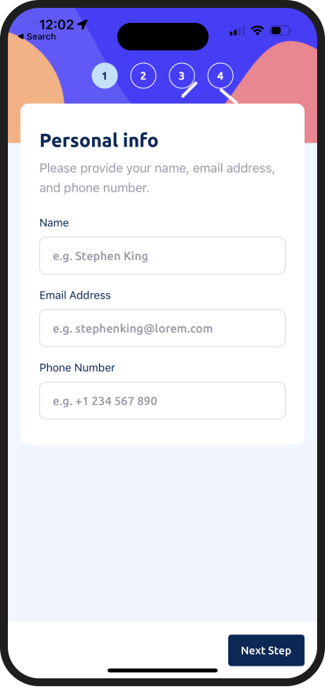

# Frontend Mentor - Multi step form solution

Hi everyone 👋

This is a solution to the [Multi step form challenge on Frontend Mentor](https://www.frontendmentor.io/challenges/multistep-form-YVAnSdqQBJ) 🎉

## Table of contents

- [Overview](#overview)
  - [The challenge](#the-challenge)
  - [Links](#links)
- [My process](#my-process)
  - [Built with](#built-with)
  - [Difficulties](#difficulties)
- [Author](#author)

## Overview

### The challenge

Your challenge is to build out this multi-step form and get it looking as close to the design as possible.

You can use any tools you like to help you complete the challenge. So if you've got something you'd like to practice, feel free to give it a go.

Your users should be able to:

- Complete each step of the sequence
- Go back to a previous step to update their selections
- See a summary of their selections on the final step and confirm their order
- View the optimal layout for the interface depending on their device's screen size
- See hover and focus states for all interactive elements on the page
- Receive form validation messages if:
  - A field has been missed
  - The email address is not formatted correctly
  - A step is submitted, but no selection has been made

### Links

- Solution URL: [See source code](https://github.com/ClemFRontend/multi-step-form)
- Live Site URL: [Expo Snack multi-step-form IOS](https://snack.expo.dev/@git/github.com/ClemFRontend/multi-step-form?platform=ios)

## My process

### Built with

- [React Native](https://reactnative.dev/)
- [React Navigation](https://reactnavigation.org/)
- [Expo Go](https://expo.dev/expo-go)
- [TypeScript](https://www.typescriptlang.org/)

### Difficulties

This the first I use TypeScript in a projet and it was difficult for me to learn and use it. I'm not very proud of the way I used TS in the project. I need to go deeper in the learning of TS to improve my code.

## Author

- Frontend Mentor - [@ClemFRontend](https://www.frontendmentor.io/profile/ClemFRontend)